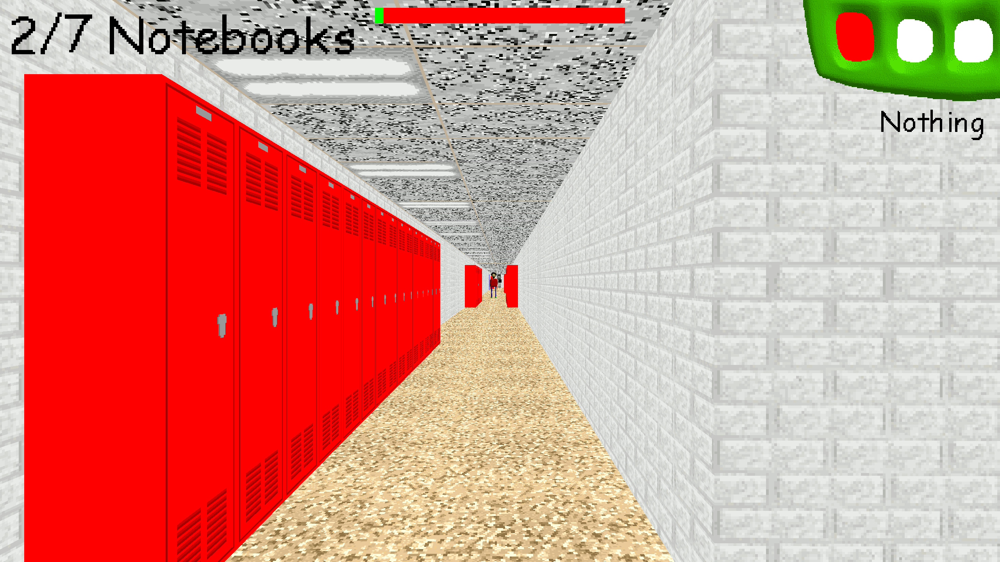
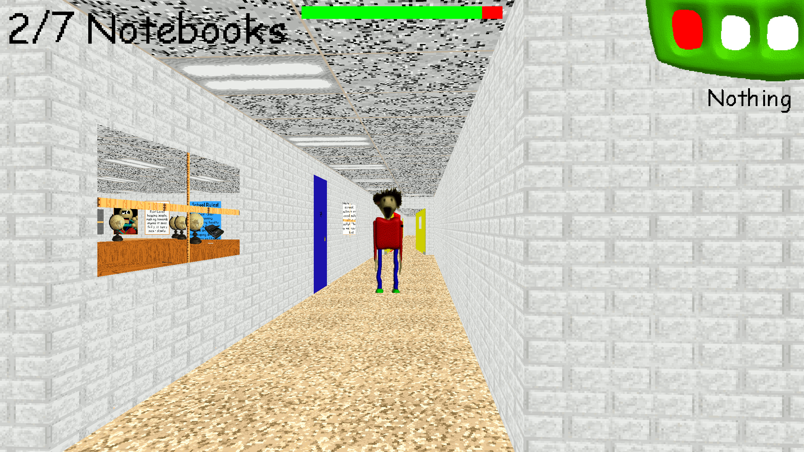

# JosephIsReal-WebPort
A web port of [Joseph Is Real.. but he's in 1.4.3](https://crofter414.itch.io/joseph-is-real-in-143)

I DID NOT CREATE JosephIsReal AT ALL! CHECK CREDITS!

ALL CREDITS ARE ALSO LINKED IN THE WEBPORT

# I WILL NOT BE RELEASING PROJECT FILES!

# Information
- The JosephIsReal mod originated from a Baldi's Basics + Mod that was made as a joke then suddenly gained attention. The mod was then taken down to the massive growth of the mod. (The mod gained PGLFilms attention)
- This is a web port of [Joseph Is Real.. but he's in 1.4.3](https://crofter414.itch.io/joseph-is-real-in-143) (Created by [Croffy Crofter](https://crofter414.itch.io)

# Credits 
MystMan12 - Creator of Baldi's Basics

- [Croffy Crofter](https://crofter414.itch.io) - (Mod Idea Maker, JosephIsReal in 1.4.3 Creator)

- [Nanes Potatoes](https://gamebanana.com/members/1713371) - Official JosephIsReal Mod Creator!

- [SillyMonkeyFlip](https://github.com/SillyMonkeyFlip) - Decompiler + WebPort Compiler

# About PGLFilms...
For context he's a pedophile, sent gore to minors and most importantly was told by the guy that made music for Baldi games to leave this community. Even after all of that lego still posted Baldi content (just waited 2 months and posted a lot of sprunki content instead) like if nothing happened.

# USE #savejosephfrompghl TO SUPPORT THE CAUSE!!!

# Media!

